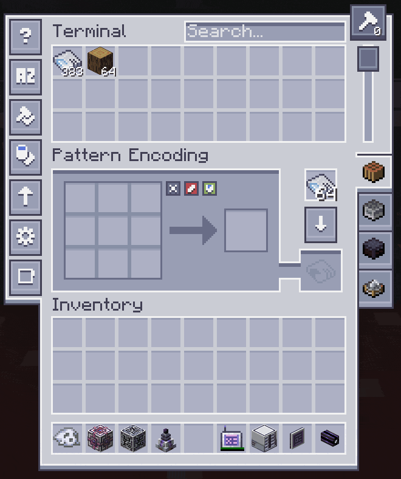

# AE2 Pattern Restocker

A lightweight quality-of-life addon for [Applied Energistics 2](https://github.com/AppliedEnergistics/Applied-Energistics-2) that enhances the Pattern Encoding Terminal with two features:

**Auto-restock** — Automatically refills the blank pattern slot from blank patterns stored in your ME network when the slot is empty and you click Encode.

**Return-to-blank button** — A small X badge on the encoded pattern slot converts the encoded pattern back to a blank pattern and returns it to the blank slot, ME storage, or your inventory (in that priority order).

No special cards, upgrades, or additional items required.

## Why this mod?

Some larger AE2 addon mods include similar functionality, but also introduce many additional features, mechanics, and balance changes. This mod exists to provide only these quality-of-life improvements in a minimal, standalone package that can be added to modpacks without significantly altering their intended experience.

## Compatibility

| Minecraft | NeoForge | AE2    | Branch |
|-----------|----------|--------|--------|
| 1.21.1    | 21.1.x   | 19.2.x | [1.21.1](https://github.com/sawces/ae2-pattern-restocker/tree/1.21.1) |
| 26.1.2    | 26.1.x   | 26.1.x | [26.1.2](https://github.com/sawces/ae2-pattern-restocker/tree/26.1.2) |

## Configuration

Both features can be toggled independently in `config/ae2_pattern_restocker-common.toml`. Both are enabled by default.

## Installation

Install through any launcher that supports CurseForge or Modrinth (CurseForge App, Modrinth App, Prism Launcher, ATLauncher, FTB App, etc.), or drop the JAR manually into your `mods` folder alongside Applied Energistics 2.

## License

MIT — see [LICENSE](LICENSE).
